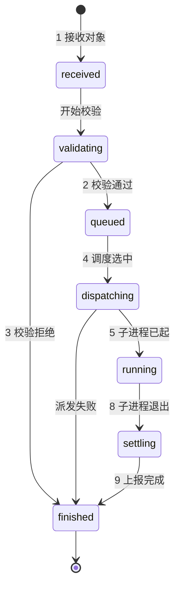

# warp-agentd 架构设计

## 1. 文档目的

本文档定义 `warp-agentd` 的职责边界、模块拆分、本地状态机和与 `wist-exec` / `wist-upgrader` 的关系。

它主要服务于 [`roadmap.md`](../../../doc/design/foundation/roadmap.md) 中的：

- `M3 Edge Runtime Skeleton`
- `M5 Controlled Action MVP`

相关文档：

- [`architecture.md`](../../../doc/design/foundation/architecture.md)
- [`action-plan-ir.md`](../../../doc/design/execution/action-plan-ir.md)
- [`agentd-failure-handling.md`](agentd-failure-handling.md)
- [`agentd-exec-protocol.md`](agentd-exec-protocol.md)
- [`roadmap.md`](../../../doc/design/foundation/roadmap.md)

---

## 2. 核心定位

`warp-agentd` 不是执行器，而是边缘控制器。

它的核心职责是：

- 常驻运行
- 接收中心侧下发对象
- 做本地校验
- 做本地 `execution_queue` 排队和并发控制
- 拉起 `wist-exec`
- 拉起 `wist-upgrader`
- 汇总本地执行结果
- 上报状态、健康和审计事件

一句话说：

- `warp-agentd` 负责控制
- `wist-exec` 负责执行
- `wist-upgrader` 负责升级辅助

### 2.1 运行模式

`warp-agentd` 第一版应明确支持两种运行模式：

- `standalone`
- `managed`

`standalone` 模式下：

- 没有中心控制节点也能启动和常驻运行
- 本地采集、发现、标准化、缓冲、上送、自观测**均不运行**（面向网关/数据面的链路与中心一起停用，
  避免无人消费的持续采集与缓冲积压）
- 本地状态机和保护模式继续工作
- 不接收远程下发的 `ActionPlan`

`managed` 模式下：

- 在 `standalone` 模式能力基础上接入中心节点
- 启用会话、心跳、能力上报
- 启用本地采集、发现、标准化、缓冲、上送与自观测（数据面链路）
- 启用远程任务与中心编排升级

这个区分必须是架构级约束，而不是实现阶段的临时兼容。

### 2.2 功能开关矩阵（standalone / managed）

下表把两种模式的功能开关固定下来（“关”表示该功能不运行，配置里即使写了也不生效）：

| # | 功能 | `standalone` | `managed` | 配置开关 | 备注 |
|---|---|---|---|---|---|
| 1 | 中心会话与注册（enrollment） | 关 | 开 | `[control_plane] enabled` | standalone 不建会话、不读 enrollment_token |
| 2 | 远程任务（ActionPlan 接收/校验/执行） | 关 | 开 | 随 `[control_plane] enabled` + `[execution]` | standalone 不接收远程计划 |
| 3 | 资源发现 | 关 | 开 | `[discovery] host_enabled / network_enabled / endpoint_enabled / process_enabled / container_enabled` | standalone 下各探测均关闭 |
| 4 | 指标采集与上报（metrics 运行时快照） | 关 | 开 | 随 discovery（无独立开关） | 依赖发现目标 |
| 5 | 日志采集（file inputs） | 关 | 开 | `[telemetry.logs] file_inputs` / `file_inputs_file` | standalone 下不接受采集清单生效 |
| 6 | 标准化（记录归一 + 上送帧生成） | 关 | 开 | 随采集链路 | 无输入则不产生记录 |
| 7 | 缓冲（内存 + spool） | 关 | 开 | `in_memory_buffer_bytes` / `spool_dir` | standalone 不落 spool，避免无人消费的积压 |
| 8 | 上送（TCP→数据面 / 本地文件输出） | 关 | 开 | `[telemetry.logs.output] kind = "tcp" \| "file"` | standalone 下两种输出均停（含纯本地落盘） |
| 9 | 自观测上报（健康/心跳/自身指标） | 关 | 开 | 无配置开关（daemon 内置） | standalone 不上报（仅保留本地日志） |
| 10 | 本地执行状态机与保护模式 | 开 | 开 | `state_store` / `[execution] max_running_actions` | 核心常驻能力 |
| 11 | 本地触发执行（本地 CLI / 手动动作） | 开 | 开 | 本地入口 | 不依赖中心；远程计划仍关闭 |
| 12 | 升级 | 本地辅助（受限） | 中心编排升级 | 见 §11 | standalone 本地升级辅助不得阻断 agent 运行 |

约束：

- 模式切换（standalone ↔ managed）时，上表相应链路随之启用/停用；standalone 下发不再产生新的 spool。
- standalone 是“本地执行器 + 状态机”，不是“无人中心的采集器”；无中心时不得持续采集/发现/上送。

> 实现对齐：`crates/warp-agentd` 当前尚未完全按本表收敛（如 standalone 下 `[telemetry.logs]` 的本地 file 输出
> 与部分 discovery 默认值仍可能开启）；实现侧需按本表逐项落地并在 `agent-config-schema.md` 同步约束。

---

## 3. 明确不负责什么

`warp-agentd` 第一版不负责：

- 直接执行 `ActionPlan.program`
- 解析作者 DSL
- 本地审批判断
- 本地策略合成
- 复杂数据分析
- AI 推理

这几类能力都不应被塞回 `warp-agentd`。

---

## 4. 顶层模块（当前实现）

`warp-agentd` 源码按职责域组织为 `src/` 下的目录模块（每个目录含 `mod.rs`，由 `lib.rs`
统一 `pub mod` + `pub use` 对外导出）：

- `bootstrap/` — 初始化与运行目录布局
- `config/` — 配置加载 / 默认模板 / 校验（`config_runtime.rs`）
- `control/` — 对 gateway 控制面：注册（`enrollment`）、运行入口（`runtime_entry`）、能力上报（`capability_report`）
- `discovery/` — 资源发现与观测（host / network / process / endpoint / container / k8s / cache）
- `exec/` — 动作执行：`local_exec`（拉起 `wist-exec`）、`process_control`（子进程生命周期）、
  `execution_support`、`planner_bridge`、`quarantine`、`recovery`
- `reporting/` — 结果收敛与上报：`reporting_pipeline`、`exporter`
- `runtime/` — 常驻循环与调度：`daemon`（含 metrics/recovery/runtime_state/telemetry 子模块）、
  `scheduler`（+ queue_head/reporting_support）、`self_observability`
- `state_store/` — 本地持久状态（execution_queue / running / history / log_checkpoint_state / reporting）
- `telemetry/` — metrics 与日志采集上送：`metrics`、`logs`（文件输入在 `logs/files`）、`spool`、`warp_parse`

历史说明：早期草案曾把“控制接收 / 计划校验 / 调度 / 执行管理 / 升级管理 / 结果聚合 / 审计”规划为
平铺模块。实现中这些职责被收敛进上述域（计划校验与入队由 `scheduler` + `exec` 承担）；
升级执行体在独立 crate `wist-upgrader`（见 §11），agentd 只做编排入口；
审计类事件不设独立模块（见 §5 与 `agentd-events.md`）。

---

## 5. 模块职责（按当前域）

### 5.1 `bootstrap`

负责运行目录/状态目录初始化与权限检查（启动参数解析与运行模式选择在 `control/runtime_entry`）。

### 5.2 `config`

负责配置加载、默认模板生成与校验：

- 本地静态配置（`agentd.toml`）加载与 `${ENV}` 展开；
- 采集任务清单外置（`file_inputs_file`）加载；
- 运行模式由 `[control_plane] enabled` 决定（standalone / managed）；
- 配置校验（`wist-validate`）与 feature 开关。

### 5.3 `control`

负责与 gateway 控制面的会话与身份：

- 注册（enrollment）、凭据续期、token 清除；
- 能力上报（capability_report）与运行状态心跳（在 `runtime/daemon` 循环内上报）；
- standalone 模式（`control_plane.enabled=false`）：不建立中心会话、不接收远程计划，
  不影响其它本地模块启动。

### 5.4 调度与执行（`runtime/scheduler` + `exec`）

对下发对象的接收、校验、排队与执行在这里协作完成：

- 计划/对象接收与基础检查 → 校验（api_version / kind / 目标匹配 / 过期 / 签名与 attestation /
  capability / constraints / steps 图结构，对应状态机 `received → validating → queued/rejected`）；
- `scheduler` 负责 `execution_queue` 排队、并发上限、优先级、取消协调与总超时裁决
  （升级任务与远程动作默认互斥）；
- `exec/local_exec` 创建执行工作目录、写 `plan.json`/`runtime.json`、拉起 `wist-exec`、
  监控并转发取消信号、回收退出状态；`process_control` 负责子进程生命周期
  （存活/超时/强杀/僵尸回收）；`quarantine` 隔离异常执行；`recovery` 恢复未完成执行。

### 5.5 `reporting`

负责执行结果收敛与上报：读取本地执行结果、汇总 stdout/stderr 摘要、生成统一结果对象，
经 `reporting_pipeline`/`exporter` 上报（控制面或数据通道）。

### 5.6 `state_store`

负责本地持久状态：执行状态、`execution_queue`、运行中执行索引与 checkpoint，
crash 后恢复时重建最小现场。

### 5.7 `runtime/self_observability`

负责暴露 daemon 自身状态：健康、执行队列长度、运行中任务数、拒绝/失败计数、
运行模式与中心连接状态；配合 `telemetry` 与 `agentd-events.md` 的事件输出。

### 5.8 `telemetry`

负责指标与日志采集上送：metrics 运行时快照、文件日志输入（`logs/files`：checkpoint / tail /
rotate / multiline / spool 重放）、断连缓冲与重试、上送帧（JSON 信封 + `RAW:`）。

### 5.9 `discovery`

负责资源发现与观测（主机/网络/进程/端点/容器…），输出 target/resource 快照，
供上报与执行目标建模。

### 5.10 升级与审计（非独立模块）

- 升级：执行体在独立 crate `wist-upgrader`，agentd 侧仅调度入口与互斥约束（见 §11）；
  standalone 下本地升级辅助不应阻断 agent 正常运行；
- 审计：计划接收/拒绝、进程启动、取消与 kill、结果归档等关注点不设独立模块，
  由事件（`agentd-events.md`）与 `self_observability`/`telemetry` 承担。

---

## 6. 建议的内部边界

建议内部边界固定如下：

- `control` 只负责注册/上报与中心会话，不排队、不执行；
- 计划校验与入队由 `scheduler` 承担，不 spawn 进程（spawn 只发生在 `exec/local_exec`）；
- `scheduler` 只管调度（排队/并发/取消/超时裁决），不执行 step；
- `exec/local_exec` + `process_control` 只管子进程生命周期，不做审批与重试策略；
- `reporting` 只管收敛结果并上报，不决定重试策略；
- 状态写入收敛到 `state_store` 的唯一写路径（见 §7）。

这几个边界不能在实现中重新耦合，否则后面会很快失控。

还要补一条运行约束：

- `control`（注册/中心会话）不可用时，不得影响数据采集、执行与本地守护主循环存活。

---

## 7. 本地执行状态模型（正交设计）

`warp-agentd` 维护独立于控制平面的本地执行状态。旧稿用单一线性列表把
“流程阶段 / 终局结果 / 控制信号”混在一起（如 `cancelling`、`reporting`、`done` 与
`succeeded` 并列），既不正交也不好读。改为四个**正交维度**
（任务生命周期 / 任务执行阶段 / 终局结果 / 控制信号）：

### 7.1 四个维度

| 维度 | 取值 | 语义 | 持久化 |
|---|---|---|---|
| **Lifecycle（任务生命周期）** | `received` `validating` `queued` `executing` `finished` | 宏观阶段，单值单调前进（含接收/校验/排队等**非执行**环节） | `lifecycle` |
| **ExecutionPhase（任务执行阶段）** | `dispatching` `running` `settling` `ended` | 仅描述“怎么执行”，仅在 `lifecycle=executing` 期间有值 | `exec_phase` |
| **Outcome（终局结果）** | `none` `succeeded` `failed` `cancelled` `timed_out` `rejected` | 仅 `finished` 时非 `none`；对齐 `FinalStatus` | `outcome` |
| **Signals（控制信号）** | `cancel_requested_at` `kill_requested_at` `deadline_at` | 时间戳/标志，可与阶段并存，**不是状态** | 同名字段（已存在） |
| （执行细节） | `pid` `process_identity` `current_step_id` `attempt` | 供观测/去重/恢复 | 同名字段（已存在） |

### 7.2 执行阶段（ExecutionPhase）含义与允许的下一步

| 执行阶段 | 含义 | 允许的下一步 |
|---|---|---|
| `dispatching` | 准备 workdir、拉起 `wist-exec` | `running`；或 `ended`（派发失败） |
| `running` | 子进程执行中（写 `pid`/`process_identity`/`started_at`） | `settling` |
| `settling` | 收敛结果、准备上报 | `ended` |
| `ended` | 执行动作已结束（此后由 `lifecycle=finished` 收口） | — |

生命周期与执行阶段的联动：`lifecycle=executing` ⟺ `exec_phase ∈ {dispatching, running, settling}`；
`exec_phase=ended` 后 `lifecycle` 收敛为 `finished`（接收/校验/排队阶段不存在执行阶段）。

### 7.3 事件转移（怎么读这张表）

读表约定：

- 状态只因**事件**而改变；每行表示“该事件发生时，把『前置』改成『变更后』”。
- `∅` 表示该维度此刻还没有值；表中未列出的维度**保持不变**。
- 只有表中出现的（事件 × 前置）组合合法；其它组合一律视为非法转移并被拒绝。
- 终局结果 `outcome` 在第 8–10 行按下方“outcome 判定”填写。

| # | 事件（触发者） | 前置 | 变更后 | 备注 |
|---|---|---|---|---|
| 1 | 接收对象（控制面/本地入口） | 无记录 | `lifecycle: ∅→received` | 创建执行记录 |
| 2 | 校验通过（daemon 校验步骤） | `lifecycle=validating` | `lifecycle: validating→queued` | |
| 3 | 校验拒绝 | `lifecycle=validating` | `lifecycle: validating→finished`；`outcome: ∅→rejected` | 不进入执行阶段 |
| 4 | 调度选中（`scheduler`） | `lifecycle=queued` | `lifecycle: queued→executing`；`exec_phase: ∅→dispatching` | |
| 5 | 子进程已起（`local_exec`） | `exec_phase=dispatching` | `exec_phase: dispatching→running`；写 `pid`/`process_identity`/`started_at` | |
| 6 | `cancel` 请求（控制面/本地） | `lifecycle=executing` | `signals: cancel_requested_at = now`（阶段不变） | 进程在跑则转发终止信号 |
| 7 | `kill` 请求 | `exec_phase=running` | `signals: kill_requested_at = now`（阶段不变） | 强杀 |
| 8 | 子进程退出（`local_exec`/`process_control`） | `exec_phase=running` | `exec_phase: running→settling`；`outcome: ∅→判定值` | 见“outcome 判定” |
| 9 | 结果上报完成（`reporting`） | `exec_phase=settling` | `exec_phase: settling→ended`；`lifecycle: executing→finished` | outcome 保持 |
| 10 | 异常隔离（`quarantine`） | `exec_phase=running`/`settling` | `exec_phase→ended`；`lifecycle→finished`；`outcome=failed` | 记入 `history` |

主流程状态图（事件 1–9，`outcome` 标在终止边上）：



两条典型路径走查（逐行对照上表）：

| 路径 | 步骤 | lifecycle | exec_phase | signals | outcome |
|---|---|---|---|---|---|
| 成功 | 1–4 | `received→…→executing` | `dispatching` | — | `none` |
| 成功 | 5 | `executing` | `running` | — | `none` |
| 成功 | 8（退出码 0） | `executing` | `settling` | — | `succeeded` |
| 成功 | 9 | `finished` | `ended` | — | `succeeded` |
| 取消 | 1–4 | `received→…→executing` | `dispatching` | — | `none` |
| 取消 | 5 | `executing` | `running` | — | `none` |
| 取消 | 6 | `executing` | `running` | `cancel_requested_at=now` | `none` |
| 取消 | 8（被终止） | `executing` | `settling` | `cancel_requested_at` | `cancelled` |
| 取消 | 9 | `finished` | `ended` | `cancel_requested_at` | `cancelled` |

outcome 判定（第 8 行使用）：

- 退出码 0 → `succeeded`
- 退出码非 0 → `failed`
- 已设 `cancel_requested_at` / `kill_requested_at` → `cancelled`（即使退出码非 0）
- `deadline_at` 触发（先于进程退出） → `timed_out`
- 优先级：`timed_out` / `cancelled` > `failed` > `succeeded`

### 7.4 不变量（正交约束）

- `lifecycle=finished` ⟺ `outcome != none`；非终态时 `outcome = none`；
- `exec_phase` 仅在 `lifecycle=executing` 有值；`exec_phase=ended` 后 `lifecycle` 必为 `finished`；
- 终态唯一且不可逆（同一 `execution_id` 只能有一个 outcome）；
- `rejected` 只能由 `validating → finished` 产生（无执行阶段）；
- `timed_out` 仅在存在 `deadline_at` 且触发时出现；
- `cancel_requested_at` / `kill_requested_at` 可并存、可重复请求但只保留首次时间戳，**不改变阶段**；
- `cancelling` / `kill_requested` / `reporting` 不再是状态（分别为“信号已设”“settling 阶段”）。

### 7.5 与当前实现的映射

终态名已是正交结果（`execution_support::final_state_name` → `FinalStatus::as_state_name`）：
`succeeded` / `failed` / `cancelled` / `timed_out` / `rejected`。

`RunningExecutionState` 已具备正交字段（`pid` / `process_identity` / `deadline_at` /
`cancel_requested_at` / `kill_requested_at` / `current_step_id` / `attempt`）；目前混用的是
`state: String` 字段，按本模型含义映射如下：

| 现有 `state` 值 | 本模型语义 |
|---|---|
| `spawned` | `lifecycle=executing` + `exec_phase=running` |
| `cancelling` | `lifecycle=executing` + 信号 `cancel_requested_at`（阶段不变） |
| `kill_requested` | `lifecycle=executing` + `exec_phase=running` + 信号 `kill_requested_at` |
| `succeeded` / `failed` / `cancelled` / `timed_out` / `rejected` | `lifecycle=finished` + `outcome=同值`（`exec_phase=ended`） |
| `quarantined`（`history`） | `lifecycle=finished` + `outcome=failed`（隔离记录） |

落地建议：把 `state` 拆为 `lifecycle` + `exec_phase` + `outcome`（或保留字符串兼容并按上表规范化），
信号无需再造状态。

---

## 8. 本地数据与目录

建议 `warp-agentd` 管理三类本地数据：

### 8.1 运行目录

例如：

```text
<agent_root>/run/
  actions/
  upgrades/
```

### 8.2 状态目录

例如：

```text
<agent_root>/state/
  execution_queue.json
  running.json
  last_reported.json
```

### 8.3 日志目录

例如：

```text
<agent_root>/log/
  agentd.log
  actions/
  upgrades/
```

---

## 9. 并发与互斥

第一版建议固定以下原则：

- 远程动作执行并发数有硬上限
- 升级任务和远程动作默认互斥
- 高风险动作与升级任务默认互斥
- 同一 `action_id` 不允许在同一 agent 上并发执行

建议第一版先做最保守策略：

- action 执行固定为单并发

等本地状态机稳定后，再扩展到更高并发。

---

## 10. 与 wist-exec 的关系

`warp-agentd` 与 `wist-exec` 的关系应固定为：

- `warp-agentd` 是父进程与控制器
- `wist-exec` 是子进程与执行器
- 两者通过 [`agentd-exec-protocol.md`](agentd-exec-protocol.md) 中定义的本地协议交互

`warp-agentd` 不应：

- 直接在本进程中执行 opcode
- 直接解释 `program.steps[]`

否则三进程模型就失去意义。

---

## 11. 与 wist-upgrader 的关系

`warp-agentd` 应是 `wist-upgrader` 的调度入口，但不是升级执行体。

建议原则：

- `warp-agentd` 负责升级计划接收与互斥判断
- `wist-upgrader` 负责升级下载、校验、切换、回滚
- `warp-agentd` 负责升级结果汇总与上报

---

## 12. 启动顺序

第一版建议 `warp-agentd` 启动顺序如下：

1. 初始化工作目录
2. 加载本地配置
3. 加载本地身份与版本信息
4. 恢复最小本地状态
5. 启动控制接收入口
6. 启动调度器
7. 启动自观测导出
8. 开始接收计划

---

## 13. crash 恢复原则

第一版不要求复杂恢复，但至少应做到：

- 启动时扫描 `run/actions/*`
- 识别孤儿执行目录
- 标记上次异常退出的执行
- 将未完成执行标记为 `failed` 或 `unknown`
- 避免重复上报同一结果

这对守护进程是必要能力，不应留到太后面。

---

## 14. M3 需要冻结的最小内容

为了真正启动 `M3 Edge Runtime Skeleton`，至少需要先冻结：

- `warp-agentd` 模块列表
- 本地状态机
- 工作目录布局
- 与 `wist-exec` 的 v1 本地协议
- 并发与互斥基本原则

如果这几项不先冻结，`warp-agentd` 开发会很快陷入反复返工。

---

## 15. 当前决定

当前阶段固定以下结论：

- `warp-agentd` 必须先于 `wist-exec` 进入开发主线
- `warp-agentd` 是边缘控制器，不是 step 执行器
- `warp-agentd` 必须持有本地状态机、队列和调度能力
- `warp-agentd` 与 `wist-exec` 通过独立本地协议交互
- `warp-agentd` 与 `wist-upgrader` 保持明确互斥与调度边界
