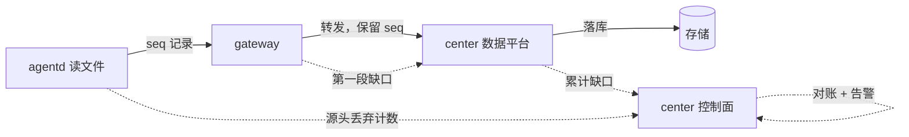
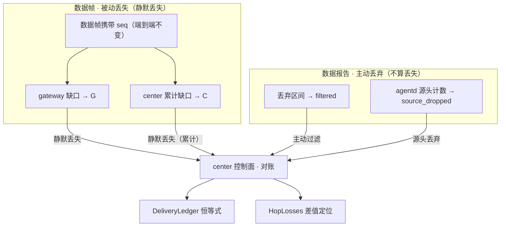

# warp-insight 数据防丢失设计

## 1. 文档目的

本文档定义 `warp-insight` 数据面（尤其文件日志采集）端到端的**防丢失**与**丢失检测**机制。

重点回答：

- 数据从采集到最终落库（`agentd → gateway → center 数据平台`），哪些环节可能丢、分别怎么防、怎么发现
- 「不丢」的交付语义是什么，代价是什么
- 多跳链路上各节点（agentd / gateway / center 数据平台）各自承担什么职责，不重复、不遗漏
- 丢失发生后，如何定位到具体是哪一跳丢的

本文档不讨论：

- 远程动作（execution）的故障与恢复（见 `agentd-failure-handling.md`）
- 指标/追踪的具体 schema（见 `doc/design/telemetry/*`）
- 上送目标的选型与 `warp-parse` 角色边界（见 `telemetry-uplink-and-warp-parse.md`）

相关文档：

- [`log-file-input-spec.md`](../../../crates/wist-agentd/docs/log-file-input-spec.md)（§11.1.1 `seq`/去重、§12 背压、§15 交付语义）
- [`agentd-failure-handling.md`](../../../crates/wist-agentd/docs/agentd-failure-handling.md)
- [`telemetry-uplink-and-warp-parse.md`](telemetry-uplink-and-warp-parse.md)
- [`architecture.md`](../foundation/architecture.md)

---

## 2. 核心结论

1. **交付语义固定为 at-least-once**：允许重复、不允许静默丢失；每一跳都遵循这一语义。
2. **防丢靠三件套**：`checkpoint`（读到哪里）+ `spool`（没送出去的先落盘）+ `seq`（每条记录唯一单调序号）。
3. **`seq` 端到端不变**：agentd 分配后，跨 gateway 转发、直至 center 落库都**保留原 `seq`**，因此下游能对整条链路做累计缺口检测。
4. **每跳接收端各做各的缺口检测**：gateway 检测 `agentd → gateway` 段，center 数据平台检测累计（`agentd → gateway → center`）。
5. **去重在最终落库点（center 数据平台）执行**，把 at-least-once 收敛成对外「恰好一次」。
6. **丢失定位靠「缺口差值」**：gateway 缺口 = 第一段丢失；center 累计缺口 − gateway 缺口 = 第二段丢失。
7. **主动过滤（filter/drop 规则、采样）是设计内行为，不是丢失**：单独计数上报（`filtered_total` + reason），不占用丢失口径。

一句话：**源头防丢、逐跳保序、下游查缺、端到端对账**。

### 防丢五层总览

| 层 | 手段 | 回答的问题 |
| --- | --- | --- |
| ① 防丢（在途） | 每跳各自 `spool` + `checkpoint` + `seq`；`write` 成功即清（不引入 ACK） | 送不出去不丢 |
| ② 检测 | `seq` 缺口（watermark 有界窗口，§8） | 丢没丢 |
| ③ 归属 | spool `seq → 内容` 映射（含 source），恢复时归源（§5.2.1） | 丢在哪条流 |
| ④ 恢复 | spool 全文 `seq→内容`，zstd + 字典 ~15x 保留 N 天（§5.2.1） | 丢的哪条能找回 |
| ⑤ 对账 | `produced = stored + filtered + source_dropped + silent_loss` + hop 差值（§9） | 丢在哪一跳 |

> ① 不丢（在途防丢），② 发现丢，③ 归到源，④ 找回内容，⑤ 定位到跳。

---

## 3. 数据链路与丢失点



两条 hop 边界，四种丢失位置：

| 位置 | 谁负责 | 手段 |
| --- | --- | --- |
| 源头（agentd 读侧） | agentd | 防丢 + 显式计数（截断/背压/读失败） |
| 第一段（agentd → gateway） | agentd + gateway | agentd at-least-once；gateway 缺口检测 |
| 第二段（gateway → center 数据平台） | gateway + center | gateway at-least-once；center 累计缺口检测 |
| 下游（center 数据平台落库） | center 数据平台 | 累计 `seq` 缺口检测 |

---

## 4. 分层职责

### 4.1 生产者（agentd）

**不做「丢失检测」**，做两件事：

- **防丢**：`checkpoint` + `spool` 保证 at-least-once——送达失败就落 spool，下次重放；checkpoint 只在记录被「送达或 spool 接纳」后推进。
- **记录源头丢弃**：截断行、背压丢弃（若启用）、读失败等显式丢弃，计入 `agent_log_records_dropped_total`，随状态/指标上报。

### 4.2 中间节点（gateway）

gateway 既是接收端、又是生产者，两侧职责不同：

- **接收端（对 `agentd → gateway` 段）**：按 `agent_id` 做第一段缺口检测（watermark 窗口，见 §8）。
- **生产者（对 `gateway → center` 段）**：`spool` + at-least-once 转发到 center 数据平台，**保留原 `seq`**。

### 4.3 最终接收端（center 数据平台）

- **累计缺口检测**：按 `agent_id` 检测整条链路（`agentd → gateway → center`）的累计缺口（watermark 窗口，见 §8）。
- **去重**：在最终落库点执行，把 at-least-once 收敛成恰好一次。
- **落库**。

### 4.4 聚合端（center 控制面）

- **对账**：汇总 agent 的 `agent_log_records_dropped_total`（源头丢）、gateway 的第一段缺口、center 的累计缺口。
- **告警/展示**：把对账结果落到监控与告警，并定位丢失发生在哪一跳。

### 4.5 接收端内部：接入层与 ETL 层的边界

`wist-delivery`（去重 + 缺口检测 + 过滤）是**接入层（ingress）**的职责，不是 ETL 的一部分：

```
TCP 接收 → [wist-delivery：去重 + 缺口检测 + 过滤] → [warp-parse ETL：解析/转换/路由] → 下游
              ↑ 传输完整性层                              ↑ 数据语义层
```

- **`wist-delivery` 在 parse 之前**：重复记录先去重、缺口先判定、过滤区间先扣除，`warp-parse` 只消费「已去重、已查缺」的干净记录流。
- **warp-parse 不集成 `wist-delivery`**：它只做 parse（WPL）/ transform（OML）/ route / 分发，不感知 `seq`。
- 若重复记录直接进 parse，会被解析两次 → 重复计数、重复副作用；若缺口不先判定，下游会在「不完整数据」上解析。

一句话：`wist-delivery` 是数据进 warp-parse 之前的「门卫」，不是 warp-parse 内部的一步。

---

## 5. 核心机制

### 5.1 checkpoint（读到哪里）

- `checkpoint_offset` 记录该文件「最后已提交」的字节偏移。
- 只在记录被**送达或 spool 接纳**后才推进。
- 原子写（`write_json_atomic`），崩溃窗口不产生坏状态。
- 重启后从 checkpoint 续读，不丢不重。

### 5.2 spool（没送出去的先落盘）

- 本地持久化待发队列；送达失败（TCP 断连/下游不可用）时，记录先落 spool。
- 每次 tick 优先重放 spool，再读新数据。
- 有上限（`spool_max_bytes`），超限进入 `pause` 背压（保完整、不丢数据，见 `log-file-input-spec.md` §7.5/§12）。
- **gateway 侧同样需要 spool**（对 `gateway → center` 段），保证中心不可达时不丢。

#### 5.2.1 spool 语义边界与恢复（方向）

- **在途缓冲，非归档**：当前 spool 送达成功（本跳 `write` 成功）即清，不做时间保留；清空时机是「发送成功」而非「下一跳 ACK」（不引入跨跳 ACK 协议）。
- **恢复语义**：spool 是 `seq → 内容` 的唯一可靠来源——源文件没有逐条 `seq→offset` 映射，且源文件保留由应用 logrotate 控制、agentd 无法保证；因此「发出去后丢」的可靠恢复只能靠 agentd 自有的 spool 全文，不能依赖回源重读。
- **保留方案（后续落地）**：送达成功后不立即删，压缩保留 N 天作为恢复窗口。
  - 压缩：**zstd + 可选字典**，预期 **~15x**（JSON 日志结构重复，字典对小记录提升明显）。
  - 量级参考：200 万×500B/天 ≈ 1GB/天 → 3 天 ~200MB；1000 万×1KB/天 ≈ 10GB/天 → 3 天 ~2GB。
  - N 按磁盘配额定，可按 input 量级分档（高量级缩短保留）。

### 5.3 `seq`（每条记录唯一单调序号，端到端不变）

- 粒度：per `agent`（全局）；形态：`u64` 单调递增。
- 分配：agentd 记录生成时取号；`next_seq` 与 checkpoint **同文件、同一次原子写**。
- 重启：从 state 续号，只要求**不回退**（不要求连续）。
- **跨 hop 保留原 `seq`**：gateway 转发不重新取号，center 落库沿用 agentd 的 `seq`。
- 上送帧信封中携带 `seq`（与 `agent` 等通用字段并列，原文仍在 `RAW:` 之后）。

> **取号时机在「读入」、不在「发送」**：记录被读入时即取号 `seq=N`，并以 `(seq, 内容)` 绑定写入 spool；发送时只是把 spool 里存的 `seq` 原样发出，**不重新取号**。因此发送时刻的 `seq` 一定等于读入时分配的号——不会因「发送」这个动作本身产生重号、错位或串内容。发送**之后**可能出现的重复（at-least-once 重发同 `seq`）与乱序（多连接/重试）由下游 `(agent, seq)` 去重和 watermark 有界窗口兜底，不是 spool/发送时刻要解决的。

### 5.4 上送帧

帧格式详见 [`telemetry-uplink-protocol.md`](telemetry-uplink-protocol.md)。要点：

```
{envelope 含 schema / agent / ts / seq} RAW: <原文>
```

原文不塞进 JSON，便于数据面审计核对与回放。帧信号无关，只靠 `seq`（per-agent 全局）去重/查缺（复合键 `(agent, seq)`），不携带 `input`/文件路径/偏移等来源细节；源归因靠 spool `seq→内容` 映射在恢复时确定（§5.2.1）。

---

## 6. 丢弃与丢失场景分类

先区分三类，语义不同、口径不同：

| 类型 | 主动/意外 | 是否算「丢失」 | 计数/检测 |
| --- | --- | --- | --- |
| 主动过滤（规则/采样/drop） | 主动 | ❌ 不算丢失 | `filtered_total` + reason（各节点上报） |
| 源头显式丢弃（截断/背压/读失败） | 主动（保护性） | ❌ 不算「静默丢失」 | agentd 计数 |
| 静默丢失（传输/下游） | 意外 | ✅ 算丢失 | `seq` 缺口检测 |

具体场景：

| # | 场景 | 类别 | 检测/记录点 |
| --- | --- | --- | --- |
| 1 | 超长行被截断提交 | 源头显式丢弃 | agentd `truncated_lines` 计数 |
| 2 | 背压/丢弃（若启用 `drop_oldest`） | 源头显式丢弃 | agentd drop 计数 + drop reason |
| 3 | 源文件读失败/权限拒绝 | 源头显式丢弃 | agentd 失败计数，恢复后续读 |
| 4 | 过滤规则命中 / 采样 | 主动过滤 | 各节点 `filtered_total` + reason |
| 5 | `agentd → gateway` 断连 | 静默丢失（at-least-once 防丢） | agentd spool 重试；gateway 缺口检测 |
| 6 | `gateway → center` 断连 | 静默丢失（at-least-once 防丢） | gateway spool 重试；center 累计缺口检测 |
| 7 | 下游收到但未落库就崩溃 | 静默丢失 | center 数据平台累计 `seq` 缺口检测 |

### 6.1 过滤时机与 `seq` 的交互（关键）

过滤发生在 `seq` 取号之前还是之后，决定它会不会干扰缺口检测：

- **取号前过滤**（agentd 采集/解析阶段）：被过滤的记录**不取号**，下游 `seq` 连续 → 缺口检测干净，过滤单独计数。
- **取号后过滤**（gateway 的下游规则，当前主路径）：被过滤的记录**已取号**，下游 `seq` 留下「洞」；靠独立数据报告上报丢弃区间，对账时从洞中扣除（§6.1.1），与真正的丢失区分。

#### 6.1.1 取号后过滤的表达：数据报告（丢弃区间）

gateway 过滤某条记录时，**不往数据流插标记**，而是两条通道分离：

1. **数据帧**：被过滤的记录不转发 → 下游 `seq` 留下「洞」；
2. **数据报告**：走独立报告通道上报丢弃区间 + `reason`。

```
agentd → gateway:   seq 0, 1, 2, 3
gateway 过滤 seq 2 → 数据帧转发 seq 0, 1, 3    （洞：seq 2）
                     数据报告 {start:2, end:2, reason:filter:x}
center 收到:         seq 0, 1, 3                （watermark 检测到洞 2）
                     报告 {2..2, filter:x}      （从洞中扣除 → 无真丢失）
```

数据报告格式（独立通道，短名见 [`telemetry-uplink-protocol.md`](telemetry-uplink-protocol.md)）：

```json
{ "agent": "agent-001", "start": 2, "end": 2, "reason": "filter:x" }
```

效果：

- 数据帧只承载真实数据，**「洞 = 主动过滤（报告）+ 被动丢失（未知）」**；有报告区间 = 主动过滤，无报告的跳号 = 真丢失。
- 被过滤的记录计入 `filtered_total`（按 `reason`），不算丢失。
- 对账：`总生产 = 落库 + filtered(报告) + 源头丢弃 + 真正缺口(lost)`。

> **通道分离是原则**：数据帧只能表达被动丢失（洞），主动过滤一律走独立数据报告；二者在通道上不混。

---

## 7. 去重规则

在**最终落库点（center 数据平台）**执行，主键唯一：

1. **主键 `(agent_id, seq)`**：命中即丢弃，对所有信号通用（`seq` per-agent 全局）。

> 不引入位置/世代辅助判据：`next_seq` 与 checkpoint 同文件、同一次原子写，崩溃窗口内「已 spool、未提交 checkpoint」的记录重读时会沿用**同一个** `seq`（`next_seq` 未推进），因此 `seq` 去重已覆盖崩溃窗口重复，无需 `(file_id, offset)` 位置判据。

> 中间节点（gateway）可选择性做去重以减少转发量，但**最终去重以 center 数据平台为准**。

---

## 8. 缺口检测（watermark / 有界窗口）

**前提：多连接 / 多 gateway 从上线就存在**，单 `agent_id` 流内顺序不保证。因此不能用单一 `last_seen_seq` 游标，必须用**有界窗口 + watermark**（Flink/Spark 同款）。

每跳接收端按 `agent_id` 维护：

- `high_watermark`：已观测到的最大 `seq`；
- `low_watermark = high_watermark - lag`：窗口下界（`lag` 为允许的乱序容忍窗口）；
- `observed`：窗口内已观测到的 `seq` 集合（位图/有界集合）。

处理规则：

1. `seq <= low_watermark` 且未观测到 → **判定丢失**（已被乱序窗口滑过仍未到，不再是「迟到」）。
2. `seq <= low_watermark` 且已观测到 → 已提交（去重）。
3. `low_watermark < seq <= high_watermark` → 进窗口缓冲，不即时判丢（容忍乱序）。
4. `seq > high_watermark` → 推进 `high_watermark`，同时滑动 `low_watermark`，把窗口下界滑过但仍未观测到的 seq 判定为丢失。

关键：**「缺 seq」不即时判丢，而是等它滑出乱序窗口仍缺失才判丢**，从而把「乱序/迟到」和「真丢失」区分开。

### 8.1 缺口定位（端到端 `seq` 的关键优势）

设 gateway 判定的丢失数为 `G`，center 数据平台判定的累计丢失数为 `C`（均为 watermark 滑窗后确认的丢失，非即时缺口）：

```
第一段（agentd → gateway）丢失 = G
第二段（gateway → center）丢失 = C − G
端到端总丢失             = C
```

因此无需在每个节点重复全量检测，只需各跳记录自己确认的丢失数，center 控制面做差值即可定位到具体 hop。

---

## 9. 对账

### 9.1 四路信息汇总

数据帧查「被动丢失」，数据报告收「主动丢弃」，四路信息汇到 center 控制面做对账：



- **数据帧（`seq`，端到端不变）**：接收端用 watermark 做缺口检测，产出**静默丢失**计数——gateway 第一段 `G`、center 数据平台累计 `C`。
- **数据报告（控制/状态通道）**：主动行为的两类——丢弃区间（主动过滤 `filtered`）、agentd 源头计数（源头显式丢弃 `source_dropped`）。

四路合并成对账：`produced == stored + filtered + source_dropped + silent_loss`，并用 `G`/`C` 差值定位丢失发生在哪一跳。

端到端恒等式（主动过滤与源头丢弃不算「丢失」）：

```
总生产（seq 分配总数）= 成功落库 + 主动过滤 + 源头显式丢弃 + 静默丢失
```

| 来源 | 指标 | 含义 |
| --- | --- | --- |
| agentd | `agent_log_records_dropped_total` | 源头显式丢弃 |
| 各节点 | `filtered_total` + reason | 主动过滤（不算丢失） |
| gateway | 第一段缺口数 `G` | `agentd → gateway` 静默丢失 |
| center 数据平台 | 累计缺口数 `C` | 端到端静默丢失 |

缺口与过滤的对账关系：

```
# 取号前过滤（推荐）：过滤不占 seq，下游 seq 连续
静默丢失 = C（累计缺口）

# 取号后过滤：过滤占 seq，靠数据报告从缺口中扣除
静默丢失 = C − 丢弃区间上报数
```

缺口定位（过滤已扣除后）：

```
第一段（agentd → gateway）丢失 = G
第二段（gateway → center）丢失 = C − G
端到端总丢失             = C
```

---

## 10. 各节点职责总表

| 节点 | 防丢 | 缺口检测 | 去重 | 过滤 | 对账/告警 |
| --- | --- | --- | --- | --- | --- |
| agentd（生产者） | ✅ checkpoint + spool + seq | ❌ | ❌ | ✅（取号前） | 记源头丢弃 |
| gateway（中间节点） | ✅ spool 转发 + at-least-once | ✅ 第一段（`agentd → gateway`） | 可选 | 可选（取号后，需计数） | 报第一段缺口 |
| center 数据平台（最终接收端） | ✅ 落库 | ✅ 累计（端到端） | ✅ seq 去重 | 可选（取号后，需计数） | 报累计缺口 |
| center 控制面（聚合端） | ❌ | ❌（靠数据平台上报） | ❌ | ❌ | ✅ 差值对账 + 告警 |

---

## 11. 当前状态与 backlog

### 已落地

- `checkpoint`（原子写）+ `spool`（重放/背压 `pause`）✅（agentd 侧）
- `seq` / `next_seq`：取号 + 与 checkpoint 同次原子写 + 上送帧带 `seq` ✅（agentd 侧）
- 源头显式计数：`truncated_lines`、失败计数 ✅
- 通道分离（帧格式）：数据帧 `{schema, agent, ts, seq}` 只表达真实数据；主动过滤走独立数据报告 ✅
- 契约 `TelemetryRecordContract`：`+agent_id`、`-signal_kind`、`input_id` 不进帧；`DataFrame` 结构体（短名）✅
- `wist-delivery`（接收侧逻辑）：去重收敛 `(agent, seq)`、删墓碑/位置去重、主动过滤走 `on_dropped_range` ✅
  （crate 已对齐，**尚未接入接收端**）

### 待落地（W2）

- agentd 侧 `next_seq` 从 per-input 提升为 per-`agent` 全局（当前 `LogCheckpointState` 按 `input_id` 各存一个 `next_seq`，与 §5.3 的 per-`agent` 全局口径不符） ❌
- gateway 侧：`gateway → center` 的 spool/at-least-once 转发 + 第一段缺口检测（watermark 窗口） ❌
- center 数据平台侧：累计缺口检测（watermark 窗口）+ 去重 ❌
- spool 压缩保留（zstd + 可选字典，~15x，保留 N 天）作为「发出去后丢」的恢复来源 ❌
- 断连→重连的**指数退避 / 连接复用 / 超时边界** ❌
- 端到端对账与告警（`agent_log_records_dropped_total` 汇总展示） ❌

### 未决点

- `drop_oldest` 背压策略：已收敛为仅 `pause`；未来若按 input 优先级丢弃，需补齐 drop reason 计数与告警用例。
- gateway 是否在转发前做「选择性去重」以减少 `gateway → center` 转发量（最终仍以 center 去重为准）。
- watermark 窗口大小（`lag`）如何取值：与最大重试延迟、连接数、gateway 数量挂钩，需定初始默认值与可调项。
- watermark 是否跨重启持久化：崩溃后 `high/low_watermark` 丢失会短暂误判（重启窗口内不判丢），需定恢复策略。
- spool 压缩保留是否默认开启、保留天数 N 默认值：与磁盘配额、恢复需求挂钩，需定初始默认值（建议默认关或按 input 量级分档）。
